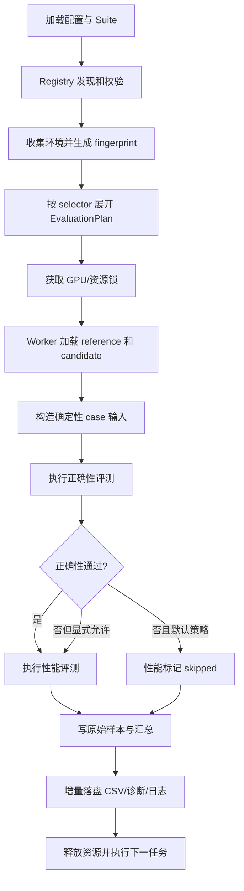

# Benchmark Engine 设计报告

## 1. 文档信息

| 项目 | 内容 |
|---|---|
| 文档状态 | Draft v1 |
| 设计目标 | 评测 Agent 生成算子的正确性与性能，并输出可复现、可诊断的 CSV 结果 |
| 输入依据 | `背景说明.md`、现有 `llm_flops` benchmark 实践 |
| 首期目标平台 | Python 3.12、Linux、单机 NVIDIA GPU |
| 首期主要负载 | PyTorch、Triton、CUDA Extension、SGLang/FlashInfer/DeepGEMM 类算子 |

## 2. 背景与问题定义

当前 `llm_flops` 已经能够为部分模型算子构造 synthetic fixture，并使用 CUDA Graph/CUDA Event 测量性能，但它仍是面向特定模型和后端的脚本集合。要把它扩展为通用 `benchmark_engine`，需要解决以下问题：

1. 原始正确算子和 Agent 生成算子如何存放、命名和自动对应；
2. 如何描述算子的输入、输出、shape、dtype、设备、可变参数和副作用；
3. 如何将算子发现、正确性评测、性能评测、结果输出解耦；
4. 如何让 Agent 无需修改引擎代码，只通过文件协议提交实现；
5. 如何量化浮点、量化、TopK、稀疏输出等不同语义的正确性；
6. 如何公平比较 reference 与 candidate 的性能，并给出加速倍率；
7. 如何区分编译、预热和稳态性能，避免首次 JIT 被误认为程序阻塞；
8. 如何形成稳定的 CSV schema、错误反馈、复现命令和维护流程。

## 3. 设计目标

### 3.1 功能目标

- 自动发现 reference 和 candidate，并建立一对多对应关系；
- 支持只运行正确性、只运行性能或两者都运行；
- 支持筛选单个算子、candidate、case、tag 和 suite；
- 支持一个算子的多个 shape、dtype、seed 和输入分布；
- 支持 Tensor、嵌套结构、标量以及带副作用算子的结果比较；
- 支持精确比较、容差比较和自定义语义比较；
- 支持冷启动/JIT、稳态 latency、吞吐、带宽、TFLOPS 和加速比；
- 结果以稳定 CSV 为主，同时保留完整诊断和原始样本；
- candidate 失败不影响其他 candidate/case 继续运行；
- 所有结果都能关联环境、源码和 case 指纹。

### 3.2 工程目标

- controller 不直接导入 Agent 代码；candidate 在 worker 子进程中运行；
- 核心能力通过 Protocol/插件扩展，避免按算子堆积 `if/elif`；
- manifest、CSV 和插件接口均带版本号；
- 单 GPU 默认串行，避免 benchmark 相互污染；
- 测量策略、阈值、失败策略全部显式记录；
- 支持从现有 `llm_flops` 增量迁移，不要求一次性重写。

### 3.3 非目标

首期不负责：

- Agent 如何生成代码；
- 自动修复 candidate；
- 在同一次评测中自动调优 kernel 参数；
- 多节点分布式 benchmark；
- 把 Agent 代码当作强安全隔离的恶意代码执行；
- 以 Nsight 取代主性能计时；
- 完整模型服务端到端 QPS/调度评测。

## 4. 核心设计决策

### 4.1 Reference 一对多 Candidate

`operator_id` 表示稳定的算子语义，一个 reference 对应任意多个 candidate：

```text
operator_id: deepseek_v4.fp8_gemm_nt
reference:   reference
candidates:  task_0042__20260716T150000Z__a1b2c3
             issue_731__20260716T151500Z__d4e5f6
```

所有 case 均由 reference 侧的算子规范定义，candidate 不能自行改变输入 shape、容差或性能测量方式。

### 4.2 约定优于配置

Agent 的最小提交只需要：

```text
operators/candidates/<operator_id>/<candidate_id>/implementation.py
```

并在文件中导出：

```python
def operator(*args, **kwargs):
    ...
```

如果需要多文件 CUDA/Triton 工程、额外入口点或编译参数，可添加可选 `candidate.yaml`。因此简单实现零配置，复杂实现仍可扩展。

### 4.3 正确性默认是性能评测的前置门禁

默认策略：

```text
correctness PASS -> performance
correctness FAIL -> performance SKIPPED
```

可通过显式参数允许错误实现继续测性能，但结果必须标记为 `perf_on_failed_correctness=true`，不能进入正式加速比排名。

### 4.4 Controller 与 Worker 分离

Controller 负责发现、规划、调度和聚合；Worker 负责导入算子、创建 GPU 上下文、执行和采样。这样可以：

- 隔离 candidate import crash；
- 为每个 candidate/case 设置 timeout；
- 捕获 stdout、stderr 和 traceback；
- 避免 candidate 修改 controller 全局状态；
- 在任务结束后通过进程退出释放 GPU 内存和 JIT 状态。

## 5. 建议目录结构

```text
benchmark_engine/
├── README.md
├── CONTRIBUTING.md
├── design.md
├── pyproject.toml
├── docs/
│   ├── index.md
│   ├── architecture.md
│   ├── operator-contract.md
│   ├── candidate-guide.md
│   ├── correctness.md
│   ├── performance.md
│   ├── result-layout.md
│   ├── csv-schema.md
│   ├── cli.md
│   ├── migration-llm-flops.md
│   ├── troubleshooting.md
│   ├── development.md
│   ├── adr/
│   │   └── 0001-result-directory-key.md
│   └── examples/
│       ├── minimal-operator/
│       └── minimal-candidate/
├── src/benchmark_engine/
│   ├── cli.py
│   ├── engine.py
│   ├── config.py
│   ├── models.py
│   ├── registry/
│   │   ├── base.py
│   │   ├── filesystem.py
│   │   └── validation.py
│   ├── execution/
│   │   ├── controller.py
│   │   ├── worker.py
│   │   ├── isolation.py
│   │   └── gpu_lock.py
│   ├── correctness/
│   │   ├── evaluator.py
│   │   ├── comparators.py
│   │   ├── metrics.py
│   │   └── diagnostics.py
│   ├── performance/
│   │   ├── evaluator.py
│   │   ├── timers.py
│   │   ├── statistics.py
│   │   ├── cost_model.py
│   │   └── profiler.py
│   ├── reporting/
│   │   ├── csv_writer.py
│   │   ├── artifact_writer.py
│   │   └── summary.py
│   └── environment/
│       ├── collector.py
│       └── fingerprint.py
├── operators/
│   ├── references/
│   │   └── <operator_id>/
│   │       ├── operator.yaml
│   │       ├── spec.py
│   │       ├── implementation.py
│   │       ├── README.md
│   │       └── assets/
│   └── candidates/
│       └── <operator_id>/
│           └── <candidate_id>/
│               ├── implementation.py
│               ├── candidate.yaml        # 可选
│               └── src/                  # 可选 CUDA/Triton 源码
├── suites/
│   ├── smoke.yaml
│   ├── regression.yaml
│   └── full.yaml
├── results/
│   ├── run_index.csv
│   └── <operator_id>/
│       └── <candidate_id>/
│           ├── history.csv
│           ├── latest.json
│           └── <evaluation_id>/
│               ├── results.csv
│               ├── correctness_outputs.csv
│               ├── performance_samples.csv
│               ├── evaluation_manifest.json
│               ├── summary.md
│               ├── diagnostics/
│               ├── logs/
│               └── profiles/
├── tasks/
└── tests/
```

说明：`operator_id` 是逻辑标识。文件系统中可使用点号，也可统一将点号映射为双下划线；首期建议直接使用小写下划线 slug，例如 `deepseek_v4_fp8_gemm_nt`，减少跨平台路径问题。

### 5.1 源码目录与结果目录的镜像关系

Candidate 源码与结果使用相同的前两级主键：

```text
operators/candidates/<operator_id>/<candidate_id>/
results/<operator_id>/<candidate_id>/
```

`results/` 不再使用 `results/<run_id>/` 作为产物根目录。一次 suite 运行仍可生成全局 `run_id`，但它只作为跨 operator/candidate 的关联字段写入 CSV 和 `results/run_index.csv`。

同一个 candidate 可能在不同环境、配置或代码状态下重复评测，因此在 candidate 结果目录下增加 `evaluation_id`：

```text
results/<operator_id>/<candidate_id>/<evaluation_id>/
```

建议格式：

```text
<UTC timestamp>__<environment short fingerprint>__<run short id>
```

示例：

```text
results/deepseek_v4_fp8_gemm_nt/task_0042__20260716T150000Z__a1b2c3/
└── 20260716T153000Z__4286ebde__r7f31a/
```

其中：

- `history.csv` 汇总该 candidate 的历次 evaluation；
- `latest.json` 记录最新一次完整 evaluation 的相对路径和状态，不使用跨平台兼容性较差的符号链接；
- `run_index.csv` 将 `run_id` 映射到本次运行产生的所有 evaluation 路径；
- `evaluation_manifest.json` 只描述当前 operator/candidate/evaluation，不再使用容易暗示 run 根目录的 `run_manifest.json` 命名。

### 5.2 根 `README.md` 设计

根 README 面向第一次使用引擎的用户，保持简短并以可执行操作为主，不重复整份设计报告。建议固定包含：

1. 项目用途和非目标；
2. 安装与环境要求；
3. 五分钟 Quick Start；
4. Reference/Candidate 最小目录示例；
5. 正确性、性能、全量模式的常用命令；
6. 如何读取 `results/<operator_id>/<candidate_id>/`；
7. 常见状态和退出码；
8. 指向 `docs/`、`design.md` 和贡献指南的链接。

README 中的 Quick Start 必须在 CI 中执行或至少做命令解析测试，避免文档命令长期失效。

根 `CONTRIBUTING.md` 面向引擎维护者，说明分支/提交要求、测试矩阵、schema 与 ADR 流程、Reference 审核权限及文档同步清单；具体开发命令和模块说明链接到 `docs/development.md`，不在两个文件中重复维护。

### 5.3 `docs/` 信息架构

| 文档 | 内容与边界 |
|---|---|
| `docs/index.md` | 文档导航、读者角色和推荐阅读顺序 |
| `docs/architecture.md` | Controller/Worker/Registry/Evaluator 架构和生命周期 |
| `docs/operator-contract.md` | `operator.yaml`、`spec.py`、输入输出、副作用和版本规则 |
| `docs/candidate-guide.md` | candidate 命名、目录、最小入口、多文件构建和禁止事项 |
| `docs/correctness.md` | comparator、容差、seed、诊断和复现 |
| `docs/performance.md` | timer、采样、公平性、JIT、加速比和门禁 |
| `docs/result-layout.md` | 镜像目录、`evaluation_id`、history/latest/run index 和保留策略 |
| `docs/csv-schema.md` | 三类 CSV 字段、类型、空值和 schema 兼容规则 |
| `docs/cli.md` | 命令、selector、退出码和示例 |
| `docs/migration-llm-flops.md` | 从当前脚本迁移到 engine 的映射步骤 |
| `docs/troubleshooting.md` | Ninja、PTXAS、JIT 锁、timeout、OOM、结果不稳定等问题 |
| `docs/development.md` | 本地开发、测试分层、发布和文档更新要求 |
| `docs/adr/` | 关键架构决策记录，包含背景、选项、结论和后果 |
| `docs/examples/` | 可复制的最小 reference、candidate 和 suite |

`design.md` 是设计基线和决策上下文；`docs/` 是实现落地后的规范说明；根 README 是操作入口。三者不能复制粘贴后分别维护，同一规范只能有一个权威来源，其他位置使用链接和摘要。

### 5.4 Operator 与 Candidate 局部文档

- 每个 reference operator 必须有 `README.md`，说明语义、输入输出、case、容差依据、cost model 和已知限制；
- `operator.yaml` 是机器可读权威，operator README 不重复所有字段，只解释设计理由和示例；
- candidate 不强制提供 README，保证 Agent 最小提交仍只有 `implementation.py`；
- 复杂 candidate 可提供 README，记录编译依赖、算法、限制和调优参数；
- 每次 evaluation 自动生成 `summary.md`，它是结果展示产物，禁止手工修改。

### 5.5 文档维护规则

- CLI、manifest 或 CSV schema 变更必须在同一提交更新对应 docs；
- 破坏性决策先新增 ADR，再修改设计和实现；
- 文档代码块应被测试提取，至少验证 YAML/JSON 语法和 CLI 解析；
- docs 使用相对链接，并在 CI 中检查死链；
- 每个文档顶部记录适用的 schema/contract 版本，不记录容易失真的“最新版本”描述；
- `docs/examples/` 必须参加 smoke test，确保示例不是伪代码。

## 6. 命名与映射协议

### 6.1 `operator_id`

规则：

```text
^[a-z][a-z0-9_]{2,79}$
```

要求：

- 全仓库唯一；
- 表示算子语义，不包含 candidate 作者或时间；
- 一旦产生正式结果，禁止直接重命名；
- 语义或签名不兼容时创建新 `operator_id`，而不是覆盖旧契约。

示例：

```text
deepseek_v4_fp8_gemm_nt
deepseek_v4_sparse_prefill_attention
deepseek_v4_trtllm_fp8_mxfp8_moe
glm5_dsa_indexer_score
```

### 6.2 `candidate_id`

建议格式：

```text
<task_identifier>__<UTC timestamp>__<source short hash>
```

示例：

```text
task_0042__20260716T081500Z__a1b2c3d4
issue_731__20260716T083000Z__e5f6a7b8
```

`task_identifier` 表示生成该 candidate 的任务、需求、实验或工作项标识，不要求是 Agent 名称。它可以来自内部 task ID、Issue ID、实验编号或人工约定，但应满足小写字母、数字、下划线和短横线组成的稳定命名规则。Agent 名称、模型名称或生成工具可作为 `candidate.yaml` metadata 单独记录。

`candidate_id` 在同一个 `operator_id` 下唯一。重新生成或修改代码必须产生新的 ID，避免旧结果被静默覆盖。目录映射时，结果目录必须复用完全相同的 `operator_id` 与 `candidate_id`。

### 6.3 自动映射

路径本身建立映射：

```text
operators/references/<operator_id>/...
operators/candidates/<operator_id>/<candidate_id>/...
```

Registry 必须校验 manifest 中声明的 `operator_id` 与路径一致。一个 candidate 不允许通过 manifest 指向另一个 operator，防止误评测。

### 6.4 Candidate 默认契约

无 `candidate.yaml` 时使用：

```yaml
schema_version: 1
entrypoint: implementation:operator
build: lazy
```

复杂 candidate 可覆盖：

```yaml
schema_version: 1
operator_id: deepseek_v4_fp8_gemm_nt
candidate_id: task_0042__20260716T081500Z__a1b2c3d4
entrypoint: implementation:run
framework: torch_cuda_extension
build:
  command: ["python", "build.py"]
  timeout_s: 900
metadata:
  task_id: task_0042
  generator: codex
  source_revision: a1b2c3d4
```

## 7. Reference 算子规范

每个 reference 目录包含声明式 `operator.yaml` 和可编程 `spec.py`。

### 7.1 `operator.yaml`

示例：

```yaml
schema_version: 1
operator_id: deepseek_v4_fp8_gemm_nt
contract_version: 1
description: DeepSeek V4 FP8 GEMM NT
reference_entrypoint: implementation:operator
spec_entrypoint: spec:SPEC
device_types: [cuda]
tags: [deepseek_v4, gemm, fp8]

correctness:
  default_comparator: floating
  rtol: 0.02
  atol: 0.02
  equal_nan: false
  determinism_repeats: 1

performance:
  timer: cuda_event
  graph_mode: auto
  warmup: 5
  samples: 30
  inner_iterations: 20
  timeout_s: 600
  regression_threshold_pct: 5.0

cost_model: spec:cost_model
```

### 7.2 `spec.py`

声明式 YAML 不适合表达复杂 tensor layout、paged cache 和自定义比较，因此 Python spec 提供以下能力：

```python
class OperatorSpec(Protocol):
    operator_id: str

    def cases(self) -> Iterable[CaseSpec]: ...
    def make_inputs(self, case: CaseSpec, ctx: ExecutionContext) -> InputBundle: ...
    def clone_inputs(self, inputs: InputBundle) -> InputBundle: ...
    def normalize_output(self, output: object) -> OutputBundle: ...
    def comparator(self, case: CaseSpec) -> Comparator: ...
    def cost_model(self, case: CaseSpec) -> CostEstimate | None: ...
```

Reference 负责定义“什么是同一个算子”和“如何公平评测”，candidate 只负责实现函数。

## 8. 核心数据模型

建议使用不可变 dataclass/Pydantic model，并在跨进程通信时序列化为 JSON-safe metadata。

```python
@dataclass(frozen=True)
class ImplementationSpec:
    operator_id: str
    implementation_id: str
    role: Literal["reference", "candidate"]
    root: Path
    entrypoint: str
    source_hash: str
    manifest_version: int

@dataclass(frozen=True)
class CaseSpec:
    case_id: str
    symbols: Mapping[str, int | str | bool]
    seed: int
    tags: frozenset[str]
    timeout_s: int | None = None

@dataclass(frozen=True)
class EvaluationPlan:
    run_id: str
    mode: Literal["all", "correctness", "performance"]
    jobs: tuple[EvaluationJob, ...]
    environment_fingerprint: str

@dataclass(frozen=True)
class EvaluationIdentity:
    run_id: str
    evaluation_id: str
    operator_id: str
    candidate_id: str

@dataclass(frozen=True)
class CaseResult:
    identity: EvaluationIdentity
    correctness: CorrectnessResult | None
    performance: PerformanceResult | None
    status: str
    artifacts: tuple[str, ...]
```

状态必须使用稳定枚举：

```text
planned
running
passed
failed
skipped
unsupported
error
timeout
oom
crashed
```

## 9. Registry 设计

### 9.1 接口

```python
class OperatorRegistry(Protocol):
    def discover(self) -> RegistrySnapshot: ...
    def get_reference(self, operator_id: str) -> ImplementationSpec: ...
    def get_candidates(self, operator_id: str) -> Sequence[ImplementationSpec]: ...
    def get_operator_spec(self, operator_id: str) -> OperatorSpec: ...
    def validate(self) -> Sequence[RegistryIssue]: ...
```

### 9.2 文件系统 Registry 流程

1. 扫描 `operators/references/`；
2. 校验每个 reference 的 manifest、spec 和入口；
3. 扫描 `operators/candidates/`；
4. 按路径建立 operator/candidate 对应；
5. 对源码目录计算内容 hash；
6. 检查重复 ID、路径越界、缺失入口和不支持的 schema；
7. 生成只读 `RegistrySnapshot`；
8. 在 controller 中只读取 metadata，不导入 candidate。

### 9.3 Registry 校验失败策略

- reference 无效：对应 operator 的所有任务标记 `error`；
- 单个 candidate 无效：只标记该 candidate `error`；
- 重复 candidate ID：启动前配置错误，退出码 2；
- 未找到筛选目标：启动前配置错误，退出码 2；
- candidate 多出未注册 operator：报告 orphan candidate，不自动运行。

## 10. Suite 与 Case 设计

### 10.1 Suite

Suite 只组合已有 operator/case，不复制算子定义：

```yaml
schema_version: 1
suite_id: regression
operators:
  include: ["deepseek_v4_*"]
  exclude: ["*_experimental"]
cases:
  tags: [representative]
mode: all
correctness:
  seeds: [0, 1, 2]
performance:
  samples: 30
  inner_iterations: 20
```

建议提供：

- `smoke`：最小 shape、一个 seed、正确性优先；
- `regression`：代表性 shape、多 seed、正式门禁；
- `full`：边界、压力和全部 profile；
- `profile`：只选择少数 case 供 Nsight 使用。

### 10.2 Case 类型

每个 operator 至少包含：

- `smoke`：能快速发现 import/API/launch 错误；
- `representative`：真实常用 shape；
- `boundary`：最小值、非对齐值、尾块、空 local expert 等；
- `stress`：大 shape、显存高水位；
- `adversarial`：极值、零值、NaN/Inf 策略允许时的特殊数据。

Case 由 metadata 描述，输入由 `make_inputs()` 在运行时生成，不默认持久化巨型 tensor。

### 10.3 输入可复现性

- 每个 case 有固定 seed；
- 使用显式 `torch.Generator(device=...)`，不依赖全局 RNG；
- reference 与 candidate 获得语义相同但物理隔离的输入副本；
- 输入 metadata、生成器版本和 case hash 写入结果；
- 对超大 tensor 默认只 hash 配置，不做全量内容 hash；
- 需要固定数据集时使用安全格式，如 safetensors/NPZ，避免加载不可信 pickle。

### 10.4 输入与副作用

`InputBundle` 应支持 `args`、`kwargs` 和命名 state：

```python
@dataclass
class InputBundle:
    args: tuple[object, ...]
    kwargs: dict[str, object]
    observed_state: dict[str, object]
```

如果算子原地修改 cache，必须把修改后的 cache 注册到 `observed_state`，正确性评测同时比较返回值和副作用。默认禁止 reference 与 candidate 共享可变 tensor。

## 11. Benchmark Engine 生命周期



结果必须逐 case 增量落盘，而不是全部结束后一次写入。长时间 JIT、进程 crash 或机器中断时，已经完成的结果仍可恢复。

## 12. 正确性评测设计

### 12.1 基本流程

1. 根据 case 和 seed 生成 canonical inputs；
2. 克隆一份给 reference，一份给 candidate；
3. 在相同 device/stream/dtype 配置下执行；
4. GPU 同步，捕获异步 launch 错误；
5. 将输出转换为统一 `OutputBundle`；
6. 按输出路径选择 comparator；
7. 计算 pass/fail、误差指标和诊断样本；
8. 可选重复执行，检测非确定性。

### 12.2 输出标准化

统一将输出展平为带路径的叶子：

```text
output
output[0]
output.logits
output.indices
state.kv_cache
```

每个叶子记录：dtype、shape、device、stride/layout 和 comparator。返回结构不同但语义可映射时，由 reference 的 `normalize_output()` 统一。

### 12.3 Comparator 类型

#### ExactComparator

适用于：

- bool、整数、shape、计数；
- 必须完全一致的 index；
- bitwise deterministic 输出。

指标：mismatch count、mismatch rate、首个不一致位置。

#### FloatingComparator

基础判定：

```text
abs(candidate - reference) <= atol + rtol × abs(reference)
```

同时输出：

- max/mean/p50/p95/p99 absolute error；
- max relative error，分母使用 epsilon floor；
- RMSE；
- relative L2 error；
- cosine similarity；
- mismatch count/rate；
- reference/candidate 的 NaN、+Inf、-Inf 数量；
- 最差 K 个位置及 reference/candidate 值。

#### QuantizedComparator

适用于 FP8/FP4/INT8：

- 可比较 raw code、scale 或反量化后的语义值；
- 是否要求 raw code 一致由算子契约决定；
- 输出 saturation rate、zero rate 和 dequant error。

#### TopKComparator

适用于排序、检索和稀疏索引：

- exact ordered match；
- unordered set match；
- precision@K、recall@K、Jaccard；
- score 误差；
- tie-aware comparator，避免相同分数导致的合法顺序差异被误判。

#### StatisticalComparator

适用于有随机性的算子：

- 多次采样；
- 比较均值、方差、分位数或分布距离；
- 首期仅作为插件提供，不作为默认 comparator。

#### CustomComparator

特殊算子可由 `spec.py` 提供自定义比较器，但必须返回统一 `CorrectnessResult`，不能绕过指标记录。

### 12.4 容差策略

容差按以下优先级解析：

```text
case override
> operator output override
> operator default
> dtype global default
```

不能只使用一个全局 `rtol/atol`。例如 BF16 GEMM、FP8 GEMM、TopK indices 和量化 scale 的正确性语义不同。

建议初始默认值仅作为兜底：

| dtype | rtol | atol |
|---|---:|---:|
| FP64 | 1e-7 | 1e-9 |
| FP32 | 1e-4 | 1e-5 |
| BF16/FP16 | 1e-2 | 1e-2 |
| FP8/FP4 dequant | 由 operator 显式配置 | 由 operator 显式配置 |

正式 operator 必须在 manifest/spec 中显式审查容差，不能永久依赖默认值。

### 12.5 正确性反馈

CSV 中保留简洁摘要，完整反馈写入 `diagnostics/<result_id>.json` 和可读 Markdown：

```text
operator_id
candidate_id
case_id / seed
reproduction_command
failed_output_path
comparator / threshold
error metrics
worst mismatch samples
reference/candidate dtype, shape, stride
exception / stderr / traceback
source hash / environment fingerprint
```

Agent 应能凭一条 reproduction command 复现单个失败 case，例如：

```bash
bench run \
  --mode correctness \
  --operator deepseek_v4_fp8_gemm_nt \
  --candidate task_0042__20260716T081500Z__a1b2c3d4 \
  --case m1024_k7168_n2048 \
  --seed 1
```

## 13. 性能评测设计

### 13.1 分阶段计时

必须分开记录：

1. `import_ms`：加载 Python 模块；
2. `build_ms`：显式编译阶段；
3. `first_call_ms`：首次调用/JIT；
4. `warmup_ms`：预热总时间；
5. `graph_capture_ms`：CUDA Graph capture；
6. `steady_state_ms`：正式稳态样本；
7. `end_to_end_ms`：可选，包含 CPU launch 和同步。

这样可避免把 FlashInfer/Ninja/PTXAS 的首次编译误计入 kernel 稳态性能。

### 13.2 Timer 抽象

```python
class Timer(Protocol):
    def prepare(self, fn: Callable[[], object], config: TimerConfig) -> None: ...
    def sample(self, fn: Callable[[], object], config: TimerConfig) -> SampleBatch: ...
```

首期提供：

- `CudaEventTimer`：测 GPU elapsed time；
- `CudaGraphTimer`：固定地址/shape 的 graph replay；
- `WallClockTimer`：测 Python launch + synchronize 的端到端时间；
- `AutoTimer`：能 capture 时使用 graph，否则降级为 event。

Timer 选择必须写入 CSV，禁止混合不同 timer 的结果后直接排名。

### 13.3 采样策略

建议默认：

- 固定 warmup 下限；
- `samples=30`；
- 每个 sample 内 `inner_iterations=20`；
- 每个 sample 前后同步；
- 保留全部原始样本；
- 默认不静默删除 outlier；
- 输出 mean、median、min、max、stddev、CV、p50、p90、p95、p99。

可以在后续版本加入“预热到稳定”策略，例如最近 N 个样本 CV 小于阈值，但必须有最大预热次数。

### 13.4 Reference 与 Candidate 的公平性

- 同一 case 使用相同输入 metadata、timer、warmup 和迭代次数；
- reference 和 candidate 分别预热；
- 正式测量可采用 `R-C-C-R` 或随机交错顺序降低温度/频率漂移；
- 单 GPU 同时只允许一个正式性能任务；
- 记录 GPU 型号、驱动、CUDA、功耗/时钟设置和可见设备；
- 在测量前检查是否存在其他 compute process；
- 不允许 candidate 通过改变语义、输出 dtype 或跳过计算获得合法 speedup；
- 对原地/异步算子强制同步到契约定义的完成点。

### 13.5 性能指标

基础指标：

- cold start/JIT time；
- steady-state latency 分布；
- throughput（items/s、tokens/s、elements/s）；
- peak allocated/reserved GPU memory；
- workspace bytes；
- launch count（可选）；
- candidate/reference speedup；
- latency delta 和 slowdown percentage。

如果 operator 提供 `cost_model()`，额外计算：

```text
TFLOPS = FLOPs / latency
effective bandwidth = estimated bytes / latency
arithmetic intensity = FLOPs / bytes
```

需要明确这些是基于 cost model 的理论指标，而不是硬件计数器。

### 13.6 加速倍率

同一次 run、同一环境、同一 case 下：

```text
speedup = reference_median_ms / candidate_median_ms
latency_delta_ms = candidate_median_ms - reference_median_ms
slowdown_pct = (candidate/reference - 1) × 100%
```

只有正确性通过的结果才能进入正式 speedup。若 reference 或 candidate 样本不足、CV 超阈值或发生降频，应把 `performance_status` 标为 `unstable`，而不是给出可信排名。

后续可加入 paired bootstrap confidence interval；首期使用 median、CV 和最小有效样本数即可。

## 14. Nsight 扩展

Nsight 不是主计时路径，而是性能 evaluator 的可选 profiler backend：

```python
class ProfilerBackend(Protocol):
    def available(self) -> bool: ...
    def command(self, job: EvaluationJob) -> list[str]: ...
    def collect(self, output_dir: Path) -> ProfileArtifacts: ...
```

建议支持：

- Nsight Systems：CPU/GPU timeline、launch、同步、NVTX；
- Nsight Compute：选定 kernel 的 occupancy、memory throughput、tensor utilization。

约束：

- 只对显式选择的 operator/case 开启；
- 不把 profiler 下的延迟与普通 timer 结果混用；
- 保存命令、工具版本和原始 `.nsys-rep`/`.ncu-rep`；
- 通过 NVTX 标记 `build/warmup/reference/candidate/sample` 阶段。

## 15. CSV 与 Artifact 设计

### 15.1 物理目录与标识关系

结果目录必须首先按源码映射键组织：

```text
results/<operator_id>/<candidate_id>/<evaluation_id>/
```

三个标识各自承担不同职责：

| 标识 | 范围 | 用途 |
|---|---|---|
| `operator_id` | 全局稳定 | 对应 reference/candidate 的算子语义 |
| `candidate_id` | operator 内稳定 | 对应一份不可变 candidate 源码 |
| `evaluation_id` | candidate 内唯一 | 对应一次具体环境和配置下的评测产物 |
| `run_id` | 一次 CLI/suite 调度 | 跨多个 operator/candidate 关联 evaluation，不作为物理目录根 |

`evaluation_id` 在任务规划阶段生成，并同时写入三类 CSV、`evaluation_manifest.json`、`history.csv` 和 `run_index.csv`。任何报告工具都必须能够从 `operator_id + candidate_id + evaluation_id` 唯一定位结果目录。

路径创建规则：

- `operator_id` 和 `candidate_id` 必须先通过 Registry 校验，再用于拼接路径；
- 自动生成的 `evaluation_id` 不依赖 candidate 自己提供的字符串；
- 目标 evaluation 目录已存在时默认拒绝覆盖，只有 `--resume` 可以继续；
- candidate 源码改变后必须改变 `candidate_id`，不能只创建新的 evaluation 来掩盖源码变化；
- 删除 candidate 源码不自动删除对应结果，历史结果按保留策略独立管理。

### 15.2 主结果 `results.csv`

一行表示一个 `operator × candidate × case × seed` 的汇总结果。

建议 schema v1：

| 分组 | 字段 |
|---|---|
| Schema | `schema_version` |
| Run | `run_id`, `evaluation_id`, `timestamp_utc`, `suite_id`, `mode` |
| Identity | `result_id`, `operator_id`, `contract_version`, `candidate_id`, `reference_id` |
| Source | `candidate_source_hash`, `reference_source_hash` |
| Environment | `environment_fingerprint`, `device`, `gpu_name`, `cuda_version`, `torch_version` |
| Case | `case_id`, `case_hash`, `seed`, `tags`, `input_summary` |
| Status | `status`, `correctness_status`, `performance_status`, `skip_reason` |
| Correctness | `correctness_pass`, `failed_output_count`, `max_abs_error`, `max_rel_error`, `rmse`, `rel_l2`, `cosine_similarity`, `mismatch_count`, `mismatch_rate` |
| Performance | `timer`, `import_ms`, `build_ms`, `first_call_ms`, `warmup_ms`, `graph_capture_ms`, `reference_median_ms`, `candidate_median_ms`, `candidate_p95_ms`, `candidate_stddev_ms`, `candidate_cv`, `speedup`, `slowdown_pct` |
| Derived | `tflops`, `effective_bandwidth_gbps`, `throughput`, `peak_memory_bytes`, `workspace_bytes` |
| Diagnostics | `error_type`, `error_message`, `diagnostic_path`, `stdout_path`, `stderr_path`, `profile_path` |

`input_summary` 和 `tags` 可以使用 JSON 字符串，但关键筛选字段必须独立成列。

### 15.3 `correctness_outputs.csv`

一行表示一个输出叶子：

```text
result_id
output_path
comparator
reference_dtype
candidate_dtype
reference_shape
candidate_shape
rtol
atol
passed
max_abs_error
mean_abs_error
p95_abs_error
max_rel_error
rmse
rel_l2
cosine_similarity
mismatch_count
mismatch_rate
reference_nan_count
candidate_nan_count
diagnostic_path
```

### 15.4 `performance_samples.csv`

保留原始样本，便于重新计算统计值：

```text
result_id
implementation_role
sample_index
inner_iterations
elapsed_ms
per_call_ms
order_index
gpu_clock_mhz
memory_clock_mhz
temperature_c
power_w
```

硬件监控列取不到时留空，不得伪造零值。

### 15.5 结果写入要求

- CSV 使用 UTF-8、逗号分隔、RFC 4180 quoting；
- schema 增加字段只能向后兼容，破坏性变化提升 `schema_version`；
- 每完成一个 case 立即 flush，并使用临时文件 + 原子 rename；
- 全量 traceback、tensor mismatch 样本和 profiler 文件不塞进 CSV；
- 每个 evaluation 的 `evaluation_manifest.json` 保存完整配置、命令行、环境快照和所属 `run_id`；
- candidate 根目录的 `history.csv` 在 evaluation 成功原子落盘后追加一条索引；
- `latest.json` 只在完整 evaluation 结束后更新，不能指向半成品目录；
- 根级 `run_index.csv` 只做 `run_id -> evaluation path` 关联，不存放评测明细；
- 支持 `--resume <run_id>`，通过 `run_index.csv` 和各 `evaluation_manifest.json` 找回未完成任务，并以 `result_id` 去重。

## 16. CLI 设计

建议命令：

```bash
# 查看与校验
bench list [--operator PATTERN] [--candidate PATTERN]
bench validate [--operator PATTERN]
bench env

# 执行
bench run --suite smoke
bench run --mode correctness --operator OP --candidate CANDIDATE
bench run --mode performance --operator OP --case CASE
bench run --mode all --tag representative --device cuda:0

# 结果
bench summarize results/<operator_id>/<candidate_id>/<evaluation_id>/results.csv
bench summarize --operator OP --candidate CANDIDATE --evaluation EVALUATION
bench compare --result results/OP/CANDIDATE/EVALUATION \
  --baseline-result results/OP/CANDIDATE/BASELINE_EVALUATION
bench compare --run <run_id> --baseline-run <baseline_run_id>

# Profiler
bench profile --tool nsys --operator OP --candidate CANDIDATE --case CASE
bench profile --tool ncu  --operator OP --candidate CANDIDATE --case CASE
```

关键选项：

```text
--mode all|correctness|performance
--operator <exact-or-glob>       可重复
--candidate <exact-or-glob>      可重复
--case <exact-or-glob>           可重复
--tag <tag>                      可重复
--exclude-operator <glob>
--seed <int>                     可重复
--device cuda:0
--timeout-s <seconds>
--output-root <directory>          默认 results/
--evaluation-id <id>              默认自动生成
--resume <run_id>
--perf-on-correctness-fail
--fail-fast
--keep-worker
--verbose-jit
```

默认不使用 `fail-fast`，确保一次运行能给所有 candidate 生成反馈。

## 17. 并发、资源与隔离

### 17.1 调度原则

- 正确性 CPU case 可并发；
- 同一 GPU 上的性能 case 默认串行；
- JIT/build 可以占用独立 CPU semaphore；
- 同一 JIT cache key 必须加文件锁；
- reference 与 candidate 不允许同时占用同一 GPU 做正式采样；
- 首期 `gpu_jobs_per_device=1`。

### 17.2 Worker 超时

分开设置：

- import timeout；
- build/JIT timeout；
- correctness timeout；
- performance timeout；
- profiler timeout。

超时后 controller 先发送 TERM，宽限期后 KILL，并清理该 worker 的子进程树，避免残留 Ninja/NVCC/PTXAS。

### 17.3 Agent 代码风险

子进程只能提供故障隔离，不是安全沙箱。若 candidate 来源不可信，应进一步使用容器、只读挂载、禁网、资源配额和受控用户。首期至少做到：

- candidate 路径必须在其根目录内；
- 禁止 manifest 使用任意 shell 字符串，构建命令必须是 argv 数组；
- stdout/stderr 限长并落盘；
- 文件和运行时间配额；
- controller 不加载 candidate module。

## 18. 退出码与门禁

建议：

| 退出码 | 含义 |
|---:|---|
| 0 | 所有被请求的门禁通过 |
| 1 | 至少一个 correctness/performance gate 失败 |
| 2 | 配置、manifest、selector 或 registry 错误 |
| 3 | 引擎/worker 基础设施错误 |
| 130 | 用户中断 |

Performance gate 可按 suite/operator 配置：

- 最大允许 slowdown；
- 最小 speedup；
- 最大 median latency；
- 最大 peak memory；
- 最大 CV；
- 是否允许 unsupported case。

性能门禁默认只对 correctness pass 且统计稳定的结果生效。

## 19. 从 `llm_flops` 的迁移策略

不建议直接重写所有脚本。采用 Adapter 迁移：

### 19.1 可复用内容

- `benchmark_environment.py` 的版本、符号和指纹逻辑；
- `deepseek_v4_benchmark.py` 的 shape 常量和 fixture；
- `Adapter` 中的 `name/backend/instances/kind/shape`；
- `graph_ms()` 作为 `CudaGraphTimer` 的初始实现；
- CSV 的 operator/backend/instances/call_ms/model_ms 字段；
- smoke 和环境锁测试。

### 19.2 需要重构的内容

- 将 `if/elif kind` 拆成独立 operator spec/plugin；
- 将 reference 与 candidate 的 callable 统一为实现契约；
- 增加输入克隆、输出标准化和 comparator；
- 将单值 `call_ms` 改为原始 samples + 分布统计；
- 将 JIT、warmup、steady state 分阶段；
- 将 `unavailable` 拆成 unsupported/error/timeout 等明确状态；
- 将 `run.sh` 的 venv 可执行工具 PATH 问题纳入启动器；
- 将结果从单文件临时汇总升级为增量、可恢复 artifact。

### 19.3 `instances` 与模型投影

`llm_flops` 的 `call_ms × instances` 仍然有价值，但应成为可选 `ModelProjection` 层，而不是所有 operator benchmark 的固定语义：

```text
kernel benchmark -> per-call metrics
model projection -> per-call × instance count
suite summary     -> selected projections sum
```

这样通用 engine 可以同时服务单 kernel benchmark 和模型算子占比估算。

## 20. 分阶段实现计划

### Phase 0：契约与骨架

交付：

- 目录协议、manifest schema v1；
- 根 README、docs 导航和最小可运行示例；
- 核心 dataclass/Protocol；
- 文件系统 Registry；
- `bench list`、`bench validate`；
- source hash、run ID、evaluation ID、环境指纹；
- `operators/candidates/<operator_id>/<candidate_id>` 到 `results/<operator_id>/<candidate_id>` 的镜像路径解析；
- 单元测试。

验收：一个 reference 和两个 candidate 可被自动发现并正确映射，坏 manifest 能给出确定错误。

### Phase 1：正确性 MVP

交付：

- subprocess Worker；
- Case/Input/OutputBundle；
- Exact/Floating/TopK comparator；
- 多 seed、输入克隆、异常/timeout；
- `results.csv` 和 `correctness_outputs.csv`；
- `evaluation_manifest.json`、`history.csv`、`latest.json` 和 `run_index.csv`；
- 单 case 复现命令。

验收：覆盖一个 GEMM、一个 TopK、一个原地 cache 算子；能够识别正确、数值偏差、shape 错误、异常和超时。

### Phase 2：性能 MVP

交付：

- CUDA Event、CUDA Graph、Wall Clock timer；
- JIT/warmup/steady-state 分阶段；
- 原始样本与统计；
- reference/candidate speedup；
- GPU 串行锁和残留子进程清理；
- 性能门禁。

验收：同一正确 candidate 可稳定复测，CV 可见，错误 candidate 默认跳过性能，结果包含加速比。

### Phase 3：迁移 `llm_flops`

交付：

- DeepSeek V4 GEMM、Indexer、Attention、MoE operator specs；
- Prefill/Decode suite 与 ModelProjection；
- 现有 CSV 到新 schema 的转换工具；
- 与当前结果的回归对比。

验收：同一环境下新旧稳态 latency 差异在预设噪声范围内，且新引擎增加正确性结果。

### Phase 4：工程增强

交付：

- Nsight backend；
- paired measurement/置信区间；
- 多 GPU 调度；
- 容器隔离；
- CI dashboard 和历史基线；
- 分布式/通信 benchmark 扩展。

## 21. 维护与更新规范

### 21.1 Schema 与契约版本

- manifest、suite、CSV 各自有 `schema_version`；
- operator 有 `contract_version`；
- 兼容性新增字段不提升 major schema；
- 修改输入/输出语义必须提升 contract version；
- 结果永久记录使用的所有版本。

### 21.2 Reference 管理

- reference 由用户/维护者负责正确性；
- 变更必须有 correctness golden test；
- 变更 reference 后必须重新生成基线；
- 不允许 Agent candidate 直接覆盖 reference；
- reference source hash 写入每条结果。

### 21.3 新增算子检查清单

1. 创建稳定 `operator_id`；
2. 编写 reference 和 operator manifest；
3. 定义 smoke/representative/boundary case；
4. 明确输入 mutation 和输出语义；
5. 为每个输出选择 comparator 和容差；
6. 定义 performance timer 和 cost model；
7. 添加至少一个正确 candidate fixture 和一个错误 fixture；
8. 验证 CSV、复现命令和 timeout；
9. 加入 suite；
10. 编写/更新 operator README；
11. 更新 `docs/operator-contract.md` 或相关规范链接；
12. 更新 contract version。

### 21.4 测试分层

- Unit：registry、schema、comparator、统计、CLI；
- Contract：reference/candidate 签名和 case；
- CPU Integration：进程隔离、timeout、CSV；
- GPU Smoke：每日或提交门禁的小 shape；
- GPU Regression：固定机器上的代表性 shape；
- Nightly Full：压力 case、Profiler、全部 candidate。

### 21.5 文档门禁

- 根 README Quick Start 必须通过 smoke/解析测试；
- `docs/examples/` 中的 reference、candidate 和 suite 必须能被 Registry 发现；
- CI 检查 Markdown 相对链接、代码围栏和 manifest 示例；
- CLI/schema 变更缺少对应文档更新时不得合并；
- ADR 采用递增编号，已接受 ADR 不重写结论，只能新增 superseding ADR。

## 22. Agent 任务文档规范

每个实现任务位于 `tasks/<task_id>.md`，模板如下：

```markdown
# Task <task_id>: <title>

## Status
pending | in_progress | blocked | completed

## Objective
明确、可验证的目标。

## Scope
- 允许修改的目录
- 禁止修改 reference/threshold 等约束

## Operator Contract
- operator_id
- entrypoint
- input/output 摘要
- mutation/layout/dtype 要求

## Candidate Destination
task_identifier: <task/issue/experiment id>
candidate_id: <task_identifier>__<UTC timestamp>__<source short hash>
operators/candidates/<operator_id>/<candidate_id>/
expected_result_root: results/<operator_id>/<candidate_id>/

## Acceptance Criteria
- correctness suite
- performance gate
- timeout/memory gate

## Commands
- validate
- correctness reproduction
- performance reproduction

## Progress Log
- 日期、变更、测试结果

## Decisions and Risks
- 关键设计决策
- 未解决风险

## Completion Evidence
- source hash
- run_id
- evaluation_id
- results/<operator_id>/<candidate_id>/<evaluation_id>/results.csv 路径
```

Agent 工作规则：

- 只在分配的 candidate 目录写入代码；
- 不修改 reference、case、容差或 engine 来让测试通过；
- 每次行为改变更新 candidate ID/source hash；
- 在任务文档记录命令和结果，不只写“已通过”；
- 失败时保留可复现 case 和诊断 artifact；
- 完成标准以 CSV 门禁结果为准。

## 23. 可观测性与诊断

每个 worker 日志至少包含阶段事件：

```text
DISCOVERED
WORKER_STARTED
IMPORT_STARTED / FINISHED
BUILD_STARTED / FINISHED
CORRECTNESS_STARTED / FINISHED
WARMUP_STARTED / FINISHED
SAMPLING_STARTED / FINISHED
REPORT_WRITTEN
WORKER_EXITED
```

事件使用结构化 JSON Lines，同时可生成可读日志。长 JIT 期间定时输出 heartbeat，包括当前子进程、CPU 时间和缓存锁，避免用户把正常编译误认为死锁。

## 24. 建议的首批验证算子

为了尽快验证架构，首批不要直接覆盖全部模型，建议选择三类语义不同的算子：

1. FP8 GEMM：验证浮点容差、CUDA Graph、TFLOPS、speedup；
2. TopK：验证整数/集合/排序语义 comparator；
3. Paged KV/Attention：验证复杂输入 layout、原地状态、JIT 和 workspace。

第二批再加入 FlashInfer fused MoE，因为其编译时间、权重 layout 和 EP routing 更复杂，适合检验引擎的 JIT 分阶段和 timeout，而不适合作为第一条开发链路。

## 25. 待确认的产品决策

本设计先采用以下默认值，进入实现前建议由项目负责人确认：

1. candidate 是否允许执行任意 Python 构建逻辑，还是必须在容器中运行；
2. 首期是否只支持 forward，还是必须同时验证 backward/gradient；
3. 性能排名使用同 run reference，还是允许使用历史 reference baseline；
4. 哪些指标属于 CI 硬门禁，哪些只做报告；
5. candidate 是否需要长期保留，还是只保留 source hash 和 artifact；
6. 是否需要支持多实现 entrypoint 或一个 candidate 包含多个 kernel variant；
7. `operator_id` 是否需要正式 namespace，例如 `model.family.operator`；
8. 结果是否需要上传数据库，还是首期只使用 CSV/artifact 目录。

这些决策不阻塞 Phase 0/Phase 1 的接口设计，但会影响隔离、存储和历史比较策略。
